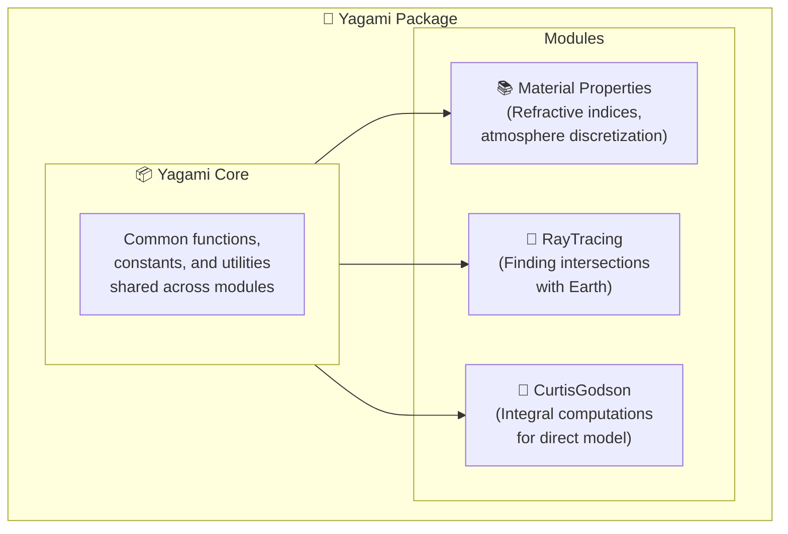

# Yagami

Package for ray tracing and retrieval for the CAIRT project.

## Structure
The package is structured as follow:\

Python scripts for the testing the material properties are adapted from the [Refractive Index Database](https://github.com/polyanskiy/refractiveindex.info-database?tab=readme-ov-file) created by [Mikhail Polyanskiy](https://www.bnl.gov/staff/polyanskiy).[^1]

# References

[^1]: Polyanskiy, Mikhail N. ["Refractiveindex. info database of optical constants."](https://www.nature.com/articles/s41597-023-02898-2) Scientific Data 11.1 (2024): 94.

