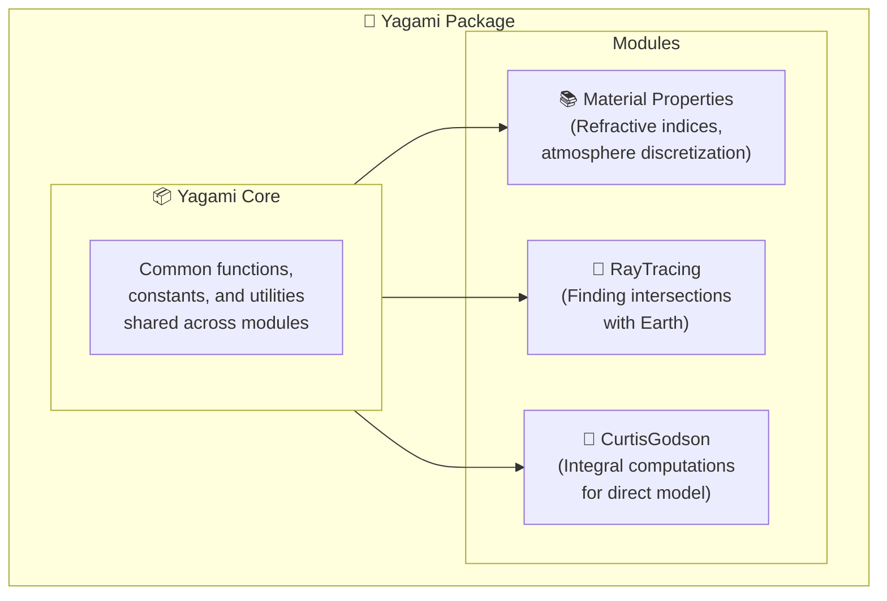

```@meta
CurrentModule = Yagami
```

# Yagami

Documentation for [Yagami](https://github.com/uriele/Yagami.jl).


Package for ray tracing and retrieval for the CAIRT project.

## Structure
The package is structured as follow:\




Python scripts for the testing the material properties are adapted from the [Refractive Index Database](https://github.com/polyanskiy/refractiveindex.info-database?tab=readme-ov-file) created by [Mikhail Polyanskiy](https://www.bnl.gov/staff/polyanskiy).[^1]


```@docs 
Yagami
```

```@autodocs
Modules = [Yagami]
```
