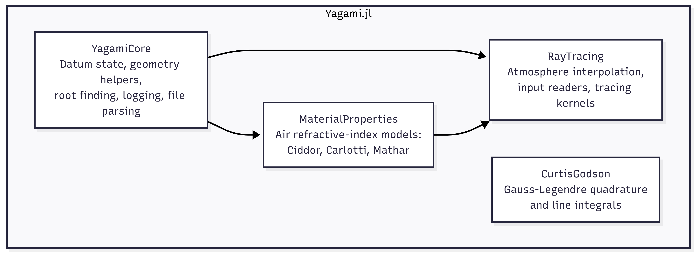

```@meta
CurrentModule = Yagami
```

# Yagami

`Yagami.jl` is a Julia package for 2D atmospheric ray tracing and related
support calculations used in the CAIRT workflow. The package combines
ellipsoidal Earth geometry, refractive-index models for air, atmospheric field
interpolation, file readers for existing mission data formats, and
Curtis-Godson-style quadrature utilities.

At the top level, `Yagami` re-exports the parts of the package that are most
useful for scientific workflows:

- ellipsoid and datum utilities from `YagamiCore`
- refractive-index models from `MaterialProperties`
- atmosphere construction, file readers, and tracing kernels from `RayTracing`
- quadrature helpers from `CurtisGodson`

## Package Map



## Typical Workflow

The main package workflow is:

1. Load or construct atmospheric fields.
2. Convert those fields into an `AtmosphereSetting`.
3. Build a refractive-index grid over wedge cells.
4. Trace each line of sight through the atmosphere.
5. Post-process the sampled ray path or integrate along it.

In practice, that usually means either:

- calling `RayTracingProblem(path)` to read an existing dataset, or
- building an atmosphere manually with `create_atmosphere`

## Quick Start

### Refractive Index

Use `MaterialProperties` directly when you only need the refractive index of
air at a given state:

```julia
using Yagami

n = refractive_index(Ciddor(), 288.15, 101325.0, 10.0, 0.0, 450.0)
```

Current unit conventions in the code are:

- temperature in K
- pressure in Pa
- wavelength in um
- humidity as a fraction in `[0, 1]`
- CO2 concentration in ppm

The code currently treats humidity as a fraction, even where some older
docstrings still describe it as a percentage.

### Build an Atmosphere

`create_atmosphere` converts gridded atmospheric fields into interpolation
objects that the ray tracer can query at arbitrary azimuth and altitude.

```julia
using Yagami

θᵢ = create_radii(Float64; θmin=0.0, θmax=350.0, radii=36)
hᵢ = create_hlevelset(Float64; hmin=4.0, hmax=120.0, levels=20)

temperatureᵢ = [220.0 + 0.02 * θ - 0.6 * h for θ in θᵢ, h in hᵢ]
pressureᵢ = [101325.0 * exp(-h / 7.0) for θ in θᵢ, h in hᵢ]

atm = create_atmosphere(
    θᵢ=θᵢ,
    hᵢ=hᵢ,
    temperatureᵢ=temperatureᵢ,
    pressureᵢ=pressureᵢ,
    humidity=0.0,
    co2ppm=400.0,
    wavelength=10.0,
    knots_θ=θᵢ,
    knots_h=hᵢ,
)

n = grid_refractiveindex(atm; model=Ciddor())
```

Important grid conventions:

- `knots_h` must be sorted in descending order
- `knots_θ` must be sorted in ascending order
- azimuth is periodic and wrapped into `[0, 360)`
- pressure interpolation uses logarithmic interpolation in altitude

### Read a Ray-Tracing Problem

When the input data already exists in a supported mission format, use
`RayTracingProblem`:

```julia
using StructArrays
using Yagami

problem = RayTracingProblem("path/to/cairt.nc")

results = StructArray(fill(SimpleResult(), 200, problem.nlos * problem.nscans))
raytracing!(results, problem)

altitude_profile = altitudelocal(results, 1)
azimuth_profile = azimuthlocal(results, 1)
```

`SimpleResult` stores one sampled point along a ray, including:

- point coordinates
- direction vector
- altitude and azimuth on the ellipsoid
- path length increment
- wedge indices `i` and `j`
- flags describing whether the crossing was level-based and whether the ray was
  descending

## Main Components

### `YagamiCore`

`YagamiCore` provides the package-wide geometric and numerical foundation:

- WGS84-based ellipsoid constants
- mutable datum state via `setdatum!`, `setmajoraxis!`, `setminoraxis!`, and
  `seteccentricity²!`
- geometric helpers for nadir and limb viewing conventions
- Brent-style root-finding and minimization support
- lightweight file and logger utilities used by the readers

The datum is stored in global references. If you change it, the new ellipsoid is
used by later calculations in the current Julia session.

### `MaterialProperties`

`MaterialProperties` implements the refractive-index models used by the ray
tracer:

- `Ciddor()` for visible to infrared air refractivity with humidity and CO2
- `Carlotti()` for a simpler pressure/temperature-based model
- `Mathar013_025()`, `Mathar028_042()`, `Mathar043_052()`,
  `Mathar075_141()`, and `Mathar160_240()` for wavelength-range-specific
  infrared models

The public interface is:

- `refractive_index(model, temperature, pressure, wavelength, humidity, co2ppm)`
- `refractive_index!(model, out, temperature, pressure, wavelength, humidity, co2ppm)`

### `RayTracing`

`RayTracing` is the operational core of the package. It contains:

- `AtmInterpolate` for atmospheric interpolation on azimuth-altitude grids
- `AtmosphereSetting` for grouped temperature, pressure, humidity, CO2, and
  wavelength fields
- `grid_refractiveindex` for cell-wise refractive-index grids
- `RayTracingProblem` for a complete tracing setup
- `raytracing!` and `raytracing_parallel!` for the tracing kernels
- Earth-shape approximations `Fukushima()` and `Bowring()`

`RayTracingProblem` bundles:

- the source filename or folder
- the atmosphere object
- the precomputed refractive-index grid
- satellite positions and viewing directions
- expected tangent heights and azimuths
- scan and line-of-sight counts
- an optional logger

### `CurtisGodson`

`CurtisGodson` currently provides:

- `QuadraturePoints`
- `get_quadrature_points`
- `linintegral`

These helpers are independent from the ray tracer and can be used anywhere a
1D Gauss-Legendre quadrature is needed.

## Supported Input Formats

`RayTracingProblem` currently supports two input formats.

### NetCDF via `NCFormat()`

`RayTracingProblem("file.nc")` defaults to `NCFormat()`. The reader expects a
CAIRT-style NetCDF file with groups and variables used by the current code:

- group `scans` with tangent points, scan azimuths, and view angles
- group `atm` with `z`, `phi`, `pressure`, and `temperature`
- group `orbit` with satellite radius

During import, the reader:

- converts pressure from hPa to Pa
- sorts altitude in descending order
- wraps azimuth into `[0, 360)` and sorts it in ascending order
- builds an `AtmosphereSetting`
- precomputes the refractive grid used by the tracer

### Geofit via `GeofitFormat()`

`RayTracingProblem("folder", GeofitFormat())` expects a directory with
`INP_FILES/` containing at least:

- `in_alt.dat`
- `in_lat.dat`
- `in_pres.dat`
- `in_temp.dat`
- `in_vmr_prof.dat`

and also uses:

- `in_levels.dat`
- `in_radii.dat`
- `orbit.dat`

The Geofit reader converts the legacy text files into the same
`RayTracingProblem` representation used by the NetCDF path.

## Current Implementation Notes

There are a few details that are useful to know when using the current package:

- `RayTracingProblem(...; model=..., meantype=...)` stores those choices on the
  problem object, but the current NetCDF and Geofit readers precompute
  `problem.refractive` with `Ciddor()` and `GeometricMean()` internally.
- `earthmodel` is used by the tracing kernels and currently has the clearest
  effect on runtime behavior.
- The low-level constructors are more flexible than the file readers. If you
  need tighter control over atmospheric fields or refractive-grid generation,
  build an `AtmosphereSetting` and call `grid_refractiveindex` explicitly.

## References

Python scripts used to validate the material-property models are adapted from
the [Refractive Index Database](https://github.com/polyanskiy/refractiveindex.info-database?tab=readme-ov-file)
created by [Mikhail Polyanskiy](https://www.bnl.gov/staff/polyanskiy).[^1]

[^1]: Polyanskiy, Mikhail N. ["Refractiveindex. info database of optical constants."](https://www.nature.com/articles/s41597-023-02898-2) Scientific Data 11.1 (2024): 94.02898-2
